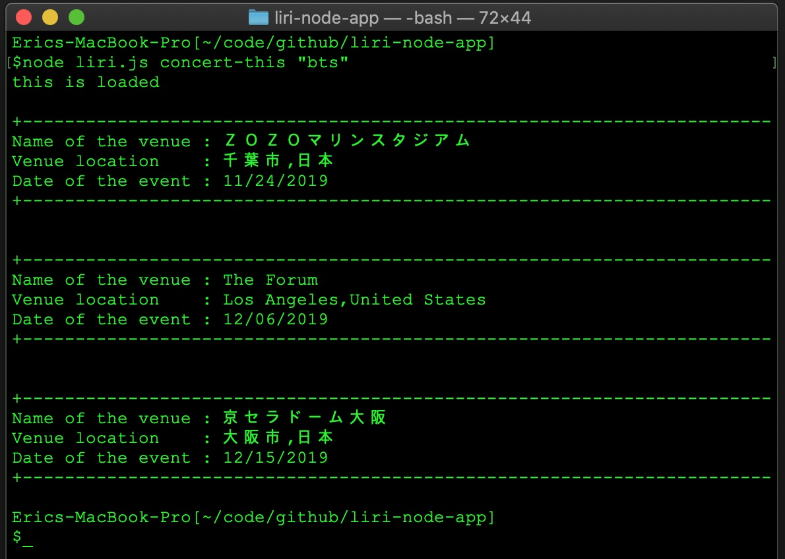
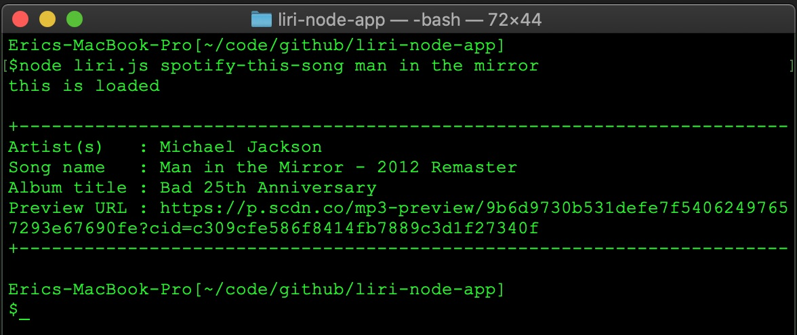
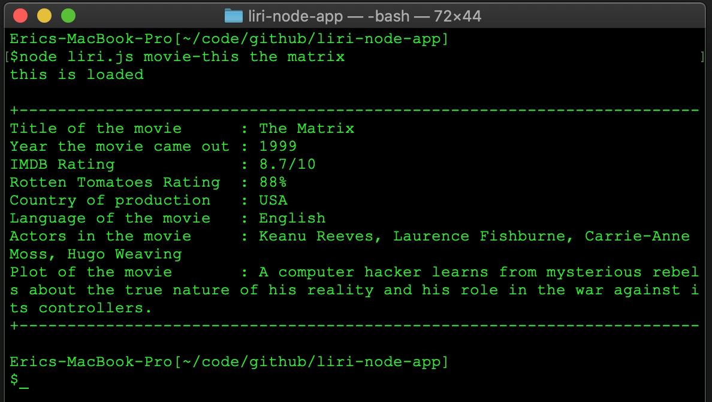
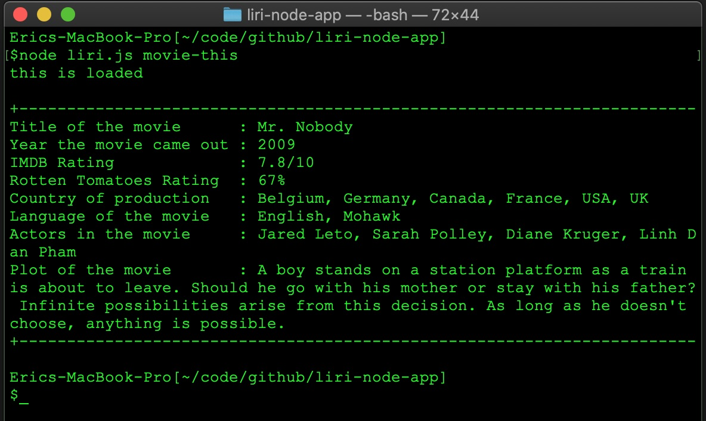
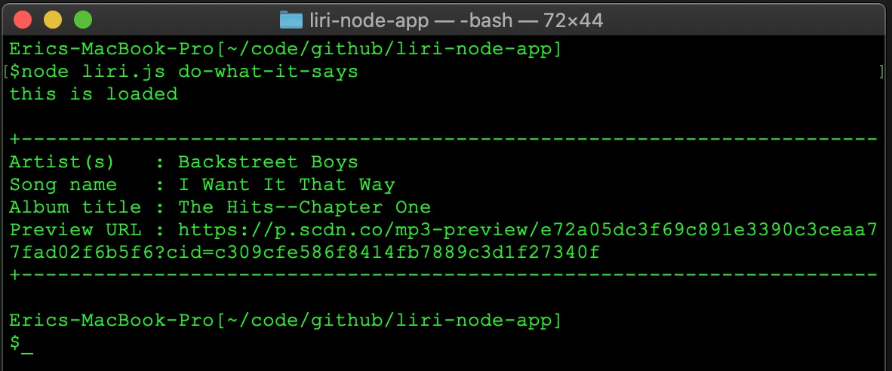
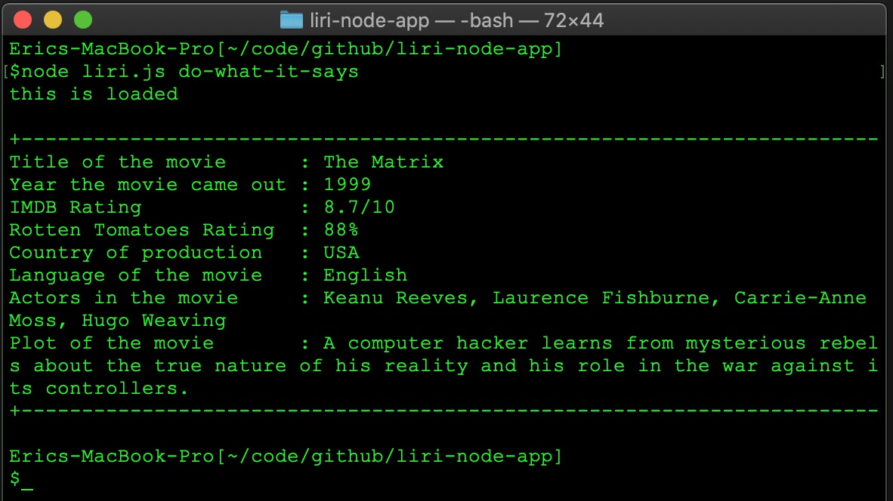
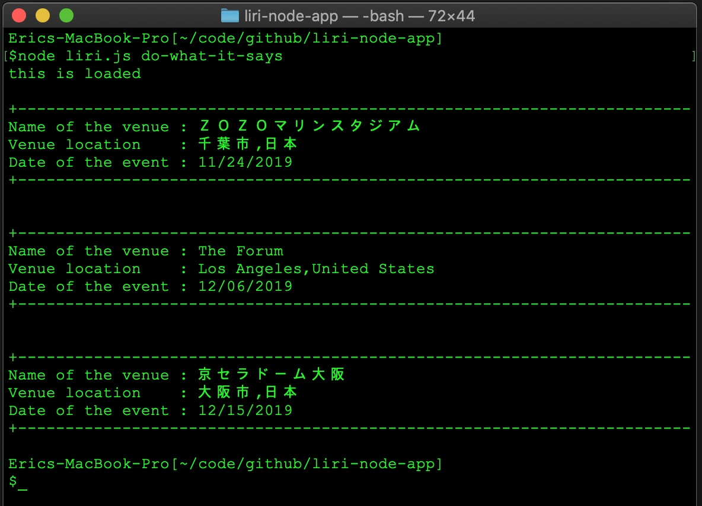

# liri-node-app
LIRI is a command line node app that takes in parameters and give search result back using API.

## Files
- liri.js - main javascript file containing functions
- keys.js - conveys spotify API key information from .env to liri.js
- .env - contains spotify API keys
- random.txt - contains series of pairs of specific command and its objective valuse separated by comma

## Execting app in command line
- node liri.js concert-this artist_name
- node liri.js spotify-this-song song_name
- node liri.js movie-this movie_name
- node liri.js do-what-it-says

## Screenshots when the app running in command line

Figure 1. Running "concert-this" command to search upcoming concert information of "bts" using "Bands in town API". npm axios used. Searched concert information includes
* Name of the venue
* Venue location
* Date of the event

Figure 2. Running "spotify-this-song" command to search song information of "man in the mirror" using "Spotify API". npm node-spotify-api used. Searched information includes
* Artist(s)
* Song name
* Album title
* Preview URL

Figure 3. Running "movie-this" command to search movie information of "the matrix" using "OMDB API". npm axios used. Searched information includes 
* Title of the movie
* Year the movie came out
* IMDB Rating of the movie
* Rotten Tomatoes Rating of the movie
* Country where the movie was produced
* Language of the movie
* Plot of the movie
* Actors in the movie

Figure 4. Running "movie-this" command to search movie information of default movie title "Mr. Nobody" when movie title was omitted on command line. "OMDB API" used. npm axios used. Searched information includes 
* Title of the movie
* Year the movie came out
* IMDB Rating of the movie
* Rotten Tomatoes Rating of the movie
* Country where the movie was produced
* Language of the movie
* Plot of the movie
* Actors in the movie

Figure 5. Running "do-what-it-says" command which runs specific sub-command after reading content of "random.txt" which contains pair of sub-command and objective value separated by comma. In this case, the content read by app was 

* spotify-this-song,"I Want it That Way"

Figure 6. Running "do-what-it-says" command which runs specific sub-command after reading content of "random.txt" which contains pair of sub-command and objective value separated by comma. In this case, the content read by app was 

* movie-this,"The Matrix"

Figure 7. Running "do-what-it-says" command which runs specific sub-command after reading content of "random.txt" which contains pair of sub-command and objective value separated by comma. In this case, the content read by app was 

* concert-this,"BTS"

## GitHub repository
* https://github.com/ericjchoi/liri-node-app

## Programmed by Eric Choi